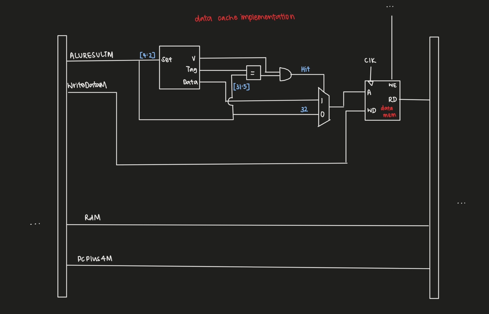

# Repository for Team 8 IAC RISC-V CPU Coursework

Team Members: Johan Jino, Shermaine Ang, Clemen Kok & Alvi Sohailul Islam 

## Documentation for Project Phase III: Pipelined CPU with Data Cache
Clemen and Shermaine working on Data Cache HDL.
Alvi and Johan testing Data Cache.

Approach:

```
DIRECT MAPPED CACHE for RISC-V CPU LOGIC FLOW:

ALURESULTM >> we access SET in the data cache. if have (we know this if V is 1 and Tag == original bitstream), then HIT. 

HIT -> RD output from Data in DataCache

-------------------------------------------------

ELSE (i.e. MISS)

We trigger the following logic:

So if at the SET we have not initialised (i.e. valid bit = 0 OR Tag != original bitstream), then HIT is 0. This means we need to extend further into the
memory hierarchy and look up the Tag in the Data Memory.

Tag is identified in data memory, and this Data is output as RD.

-------------------------------------------------

At the same time we also register it in cache so that we can access it in future cycles.

This means that we need to send it into the Data Cache as Write Data (with Write Enable), with the appropriate tag and set.

Valid Bit has to be made 1 as well.

This enables future SET and TAGs to find the data, allowing for recently accessed data to be pulled from the cache.
```

Drawing of how we envision the data cache to work with the Pipelined CPU:


Shermaine:
1. Added `data_cache.svh` and `cachebranch.svh`.
2. Edited `risc.sv` to include 2 new blocks as well as the multiplexer block.

`data_cache.svh` currently gets values of V, tag and data outputs. @clemenkok to work on how data will be stored and retrieved? 
